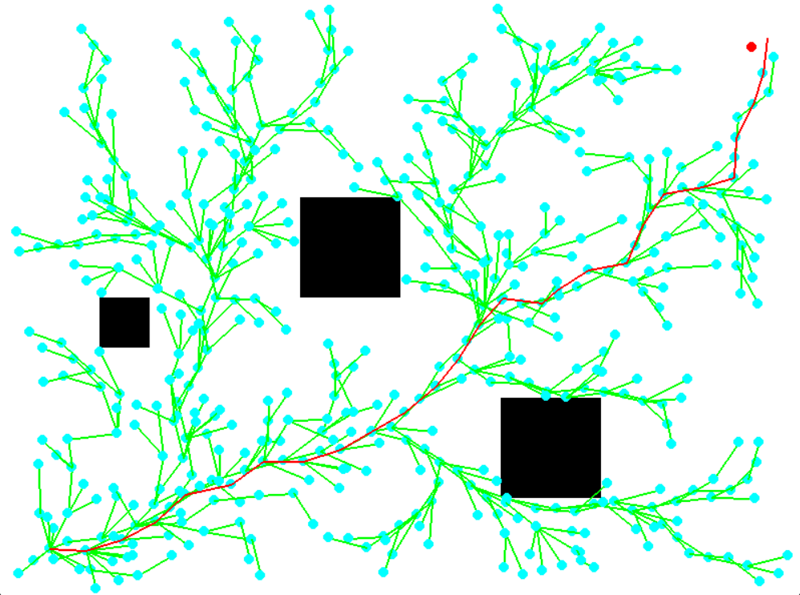
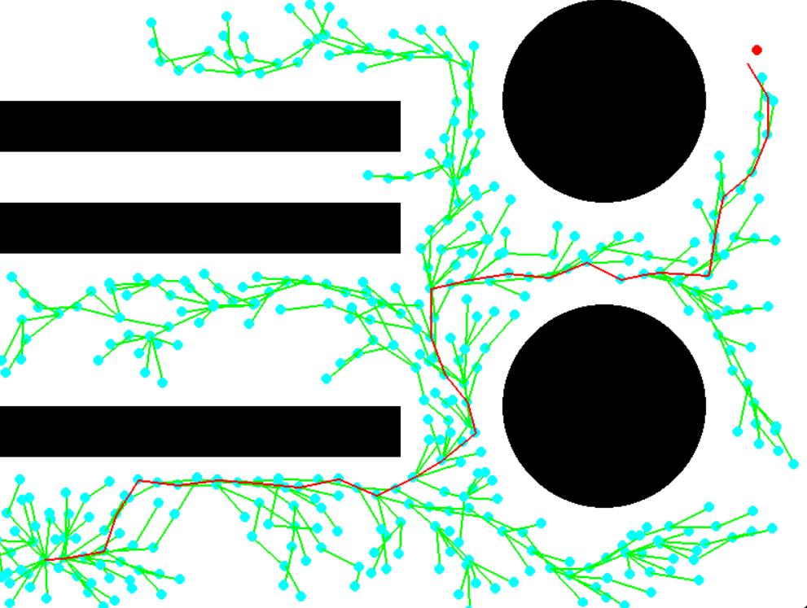
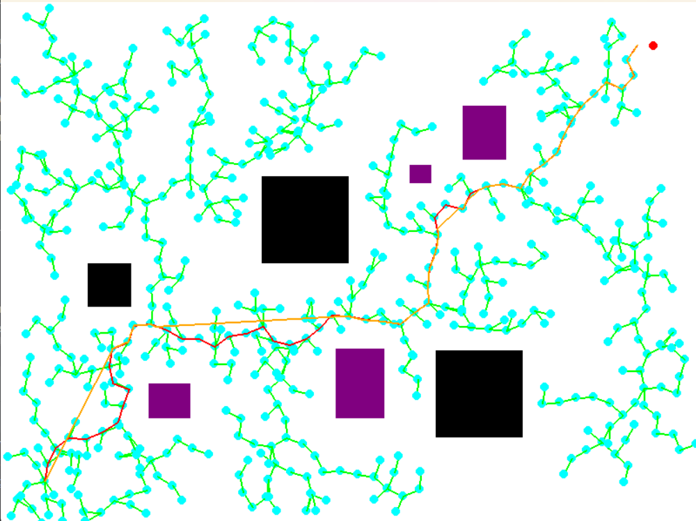
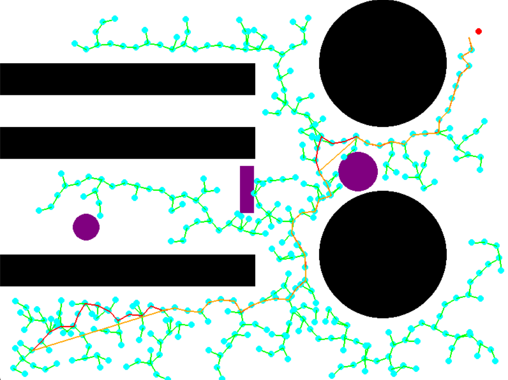
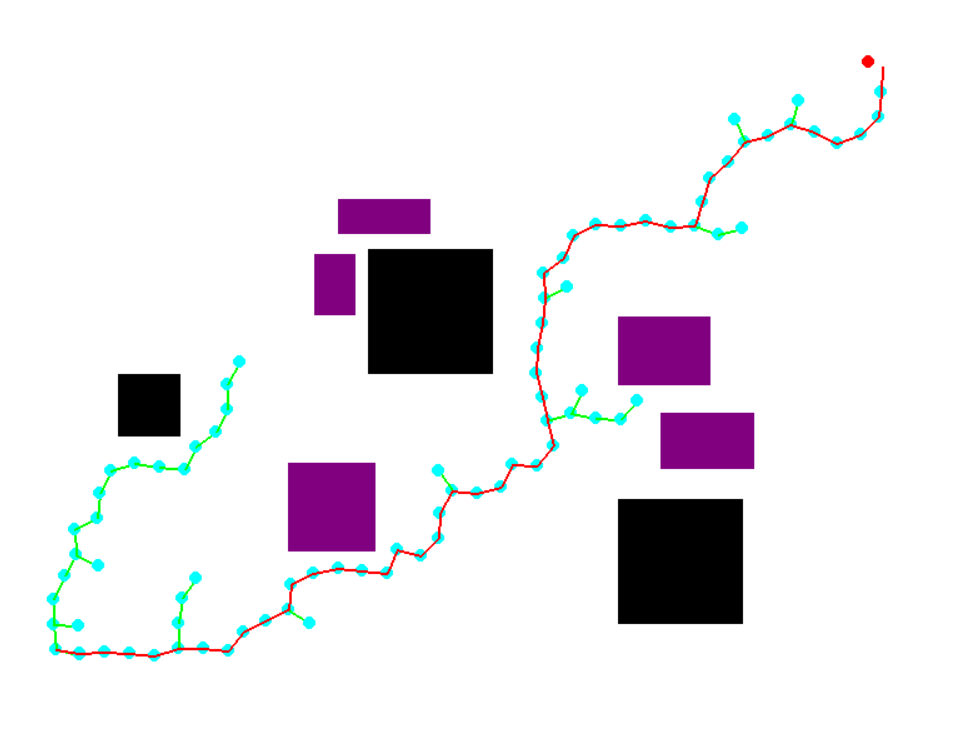
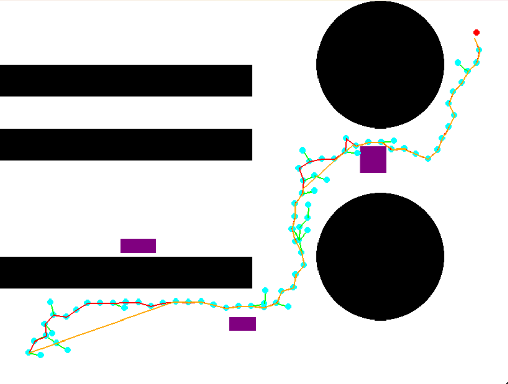

# Implementation-of-MOD-RRT-for-robot-path-planning

This project implements MOD-RRT* to find the shortest path between two points in a given obstacle-laden environment. The algorithm visualizes the pathfinding process and the final path.

### Dependencies
To run this code, you will need Python installed on your system along with the following libraries:
- numPy
- pygame
- random
- math
- time
You can install these dependencies via pip:
'''pip install numpy pygame random math time'''

### Running the Code
- Open a Terminal or Command Prompt.

- Navigate to the directory containing the script. If your script is in a folder called "Final_Project" on your desktop, you would use a command like:
cd Desktop/Final_Project

- Directly run the codes, by clicking on run button , a pygame window will pop-up and visualization starts

### Structure

There are 6 files in total
 
1.rrt_star_map1

2.rrt_star_map2

3.dynamic_rrt_star_map1

4.dynamic_rrt_star_map2

5.mod_rrt_map1

6.mod_rrt_map2

- The main codes to run are "mod_rrt_map1" and mod_rrt_map2", they have the main functionality of our project with different map settings.

- All the other codes were given for comparison.

- rrt_star_map1 and rrt_star_map2 have RRT* implementation with static obstacle definition.

- dynamic_rrt_star_map1 and dynamic_rrt_star_map2 have Dynamic RRT* implementation with static and dynamic obstacles definition.

- The algorithm is dependent on the randomly generated nodes. If the nodes are not sufficient (i.e. the path converges very quickly), the algorithm may not find a feasible path avoiding the obstacles. Hence, it is advised to rerun the program again. If the path doesn't converge, rerun the program using the above commands after pressing the ctrl+c to force quit the current run.

### Output
The program visualizes the exploration process and the final path
#### Images

  
   
  <b>Figure 1:</b> RRT* Map1.

  
   
  <b>Figure 2:</b> RRT* Map2.

  
   
  <b>Figure 3:</b> Dynamic RRT Map1.

  
   
  <b>Figure 4:</b> Dynamic RRT Map2.

  
   
  <b>Figure 5:</b> MOD RRT* Map1.

  
   
  <b>Figure 6:</b> MOD RRT* Map2.

#### Videos

1. RRT* implementation - https://drive.google.com/file/d/1LN9thg2i187xA14FL2KOaHorcXVeRgRQ/view?usp=sharing
2. Dynamic RRT* implementation - https://drive.google.com/file/d/1MiJB5ktdidfzZGStHWGAcWEpsfxgi-E_/view?usp=sharing
3. MOD RRT* implementation - https://drive.google.com/file/d/18U5pKbXhFwyG8NNLRSYxwur1E2dY81XZ/view?usp=sharing

